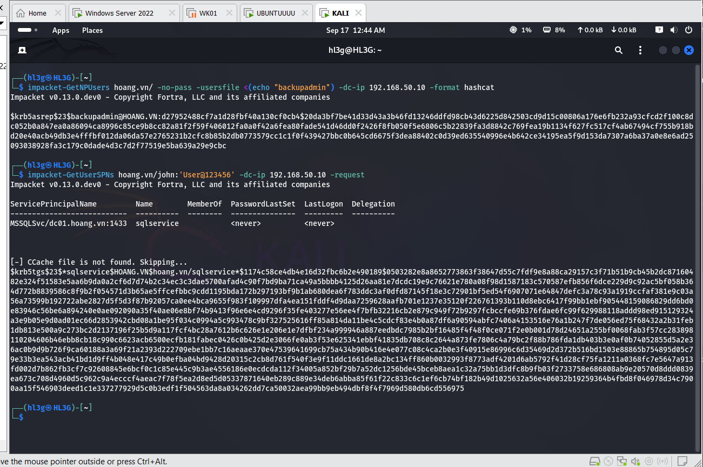
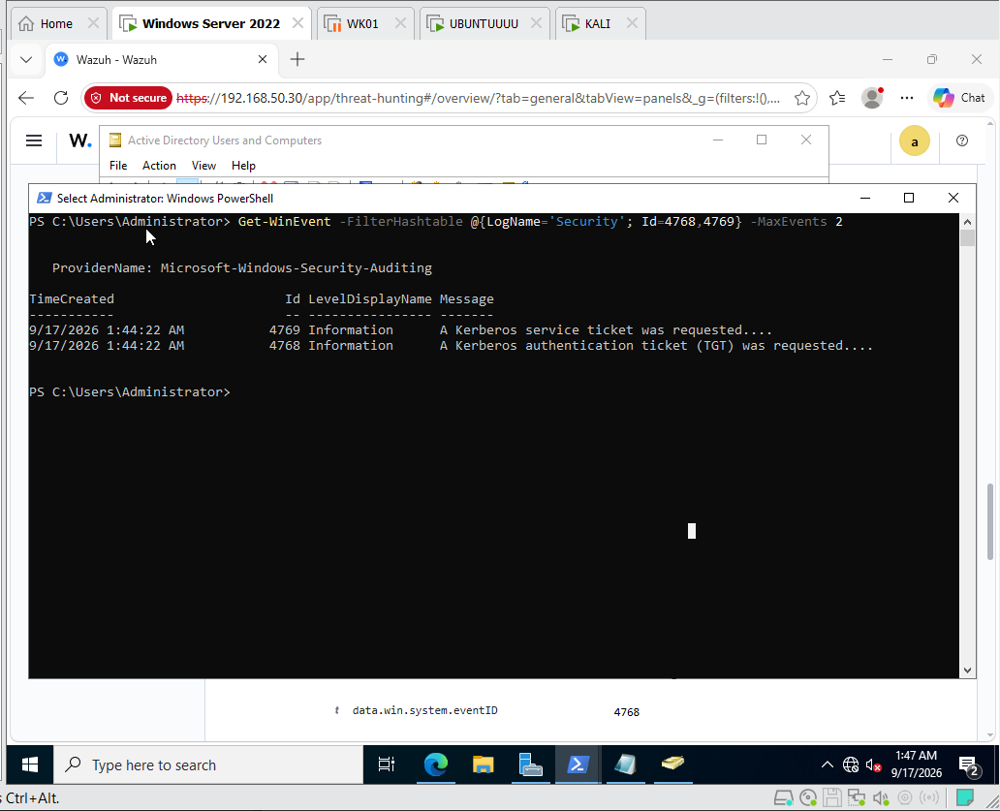
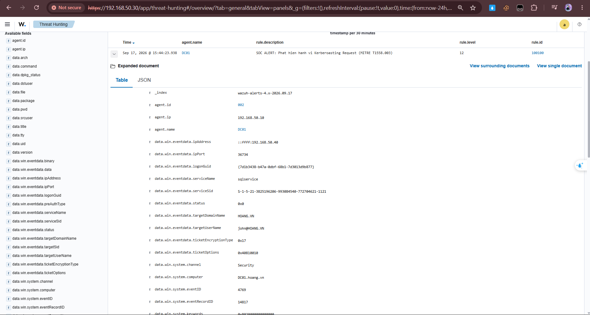
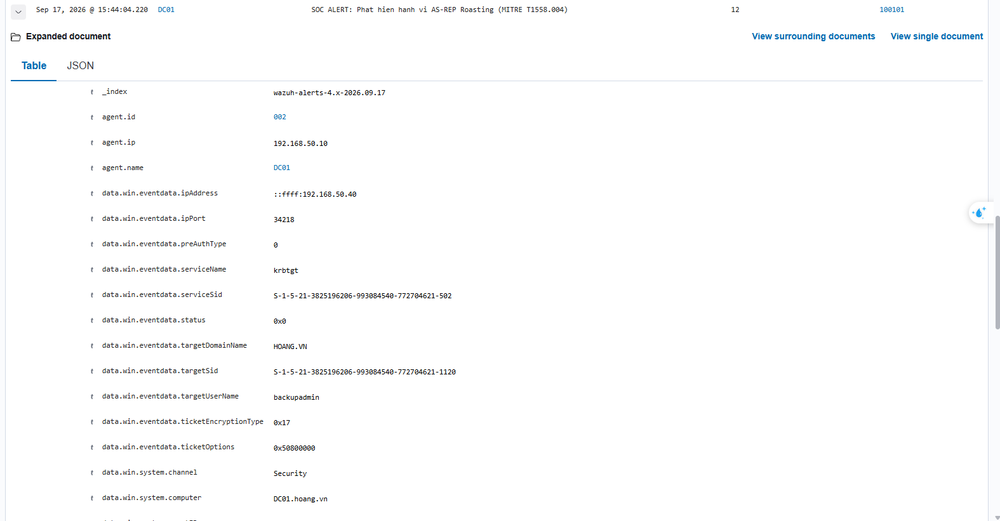
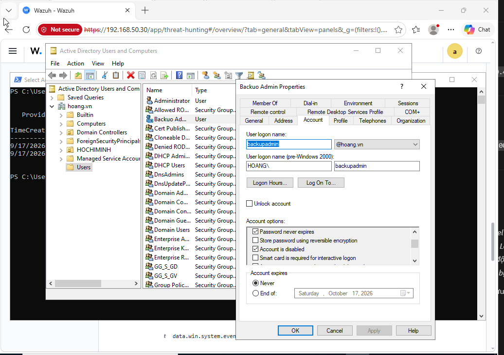
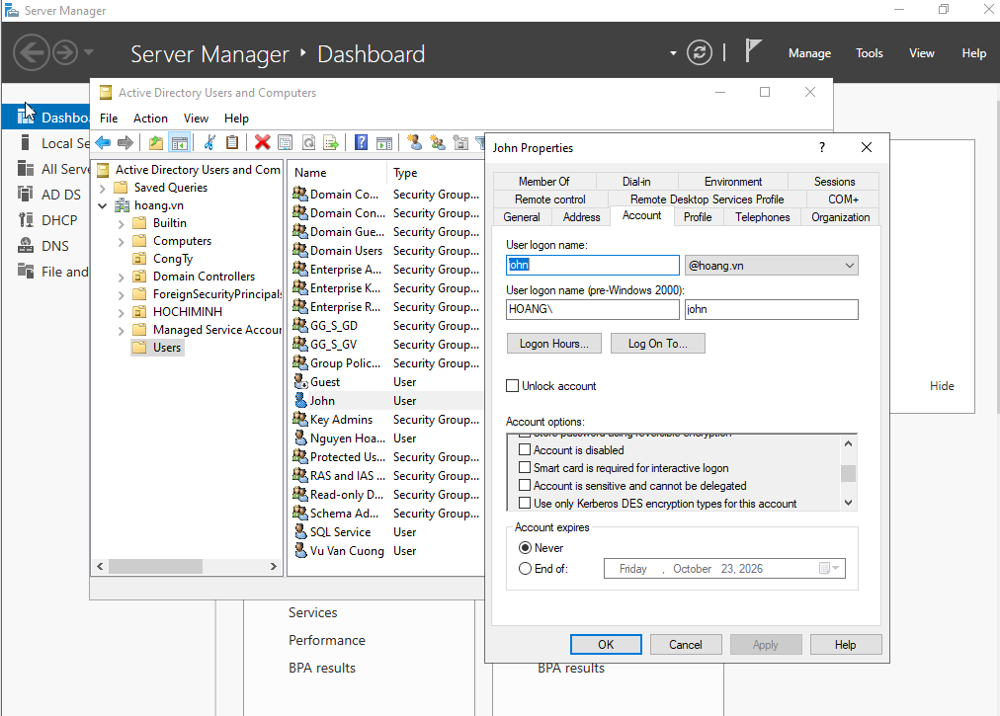
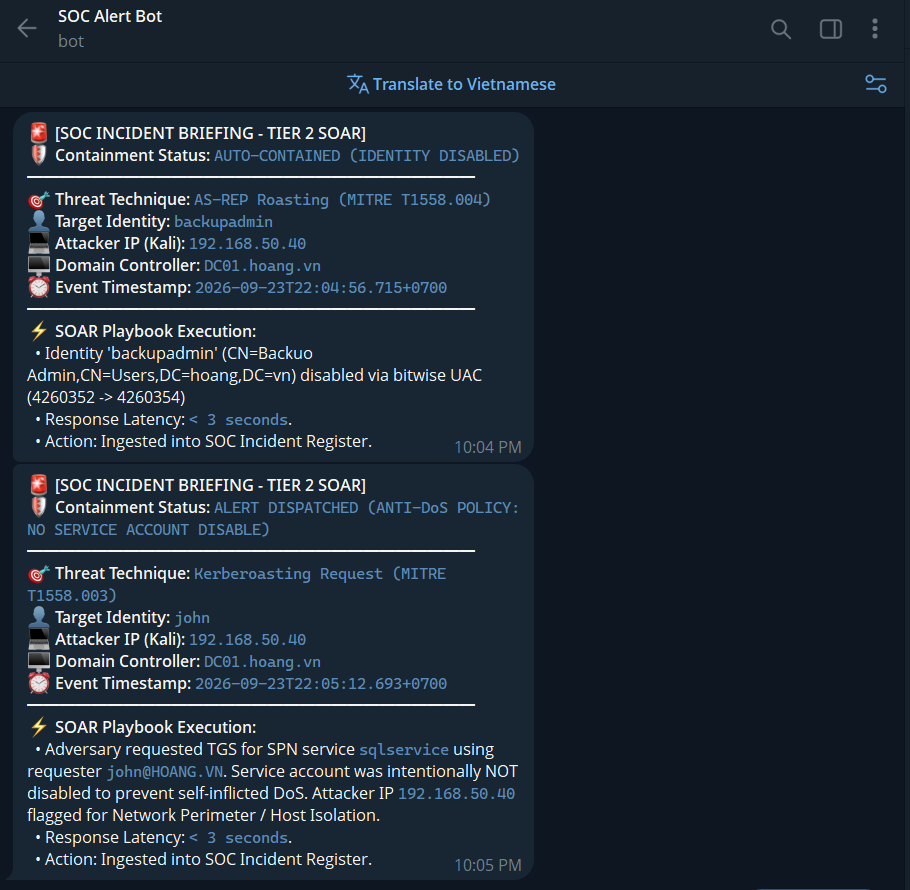

# Active Directory Threat Detection & Automated SOAR Containment

A hands-on detection engineering and automated incident response lab focused on Kerberos credential harvesting attacks (**AS-REP Roasting** and **Kerberoasting**) in an Active Directory environment.

---

## 1. Environment Topology

The lab was built on VMware Workstation using dedicated virtual machines in an isolated subnet (`192.168.50.0/24`):

| Host | OS | Role | IP Address | Details |
| :--- | :--- | :--- | :--- | :--- |
| **DC01** | Windows Server 2022 | Primary Domain Controller (`hoang.vn`) | `192.168.50.10` | Audit policies enabled for Kerberos subcategories, Wazuh Agent 4.8 |
| **SIEM-SRV** | Ubuntu 22.04 LTS | SIEM Manager & SOAR Engine | `192.168.50.30` | Wazuh Manager 4.8, custom rules, Python LDAP integration |
| **KALI** | Kali Linux | Attacker Node | `192.168.50.40` | Impacket suite (`GetNPUsers.py`, `GetUserSPNs.py`) |

### Targeted Attack Vectors
- **AS-REP Roasting (`T1558.004`):** Querying TGTs for accounts with Kerberos pre-authentication disabled (`DONT_REQ_PREAUTH`). The DC returns an AS-REP encrypted with the user's password hash, allowing offline cracking without sending further packets to the DC.
- **Kerberoasting (`T1558.003`):** Any valid domain user requests TGS service tickets for accounts registered with a Service Principal Name (SPN) specifying RC4-HMAC (`0x17`) encryption, extracting hashes for offline brute-forcing.

---

## 2. Telemetry & SIEM Detection Engineering

### Active Directory Audit Policy Baseline
To capture ticket requests, subcategory auditing was configured on `DC01` via `auditpol`:
- `Kerberos Authentication Service` -> Success/Failure (Logs **Event ID 4768** - AS-REQ/AS-REP)
- `Kerberos Service Ticket Operations` -> Success/Failure (Logs **Event ID 4769** - TGS-REQ/TGS-REP)

### Wazuh Correlation Rules (`local_rules.xml`)
Custom Level 12 and 14 correlation rules on the central manager (`/var/ossec/etc/rules/local_rules.xml`):

```xml
<group name="windows,active_directory_attacks,">

  <!-- 1. Kerberoasting Attack Detection (MITRE T1558.003) -->
  <!-- Target Event: Windows Security Event ID 4769 (Kerberos Service Ticket Operation) -->
  <!-- Forensic Indicator: Ticket Encryption Type 0x17 (RC4-HMAC) for SPN services -->
  <rule id="100100" level="12">
    <if_group>windows</if_group>
    <field name="win.system.eventID">^4769$</field>
    <field name="win.eventdata.ticketEncryptionType">^0x17$</field>
    <description>SOC ALERT: Active Kerberoasting Request Detected (MITRE T1558.003) targeting $(win.eventdata.serviceName) by account $(win.eventdata.targetUserName)</description>
    <mitre>
      <id>T1558.003</id>
    </mitre>
  </rule>

  <!-- 2. AS-REP Roasting Attack Detection (MITRE T1558.004) -->
  <!-- Target Event: Windows Security Event ID 4768 (Kerberos Authentication Service / TGT) -->
  <!-- Forensic Indicator: Pre-Authentication Type 0 (Disabled Pre-Auth), Encryption 0x17 -->
  <rule id="100101" level="12">
    <if_group>windows</if_group>
    <field name="win.system.eventID">^4768$</field>
    <field name="win.eventdata.preAuthType">^0$</field>
    <field name="win.eventdata.ticketEncryptionType">^0x17$</field>
    <description>SOC ALERT: AS-REP Roasting Attack Detected (MITRE T1558.004) targeting account without pre-auth $(win.eventdata.targetUserName)</description>
    <mitre>
      <id>T1558.004</id>
    </mitre>
  </rule>

  <!-- 3. DCSync Credential Extraction Detection (MITRE T1003.006) -->
  <!-- Target Event: Windows Security Event ID 4662 (Directory Service Access) -->
  <!-- Forensic Indicator: Replicating Directory Changes GUID: 1131f6aa-9c07-11d1-f79f-00c04fc2dcd2 -->
  <rule id="100102" level="14">
    <if_group>windows</if_group>
    <field name="win.system.eventID">^4662$</field>
    <field name="win.eventdata.properties" type="pcre2">(?i)1131f6aa-9c07-11d1-f79f-00c04fc2dcd2</field>
    <description>SOC CRITICAL: Unauthorized DCSync Domain Replication Detected (MITRE T1003.006) initiated by $(win.eventdata.subjectUserName)</description>
    <mitre>
      <id>T1003.006</id>
    </mitre>
  </rule>

</group>
```

### Wazuh Integrator Configuration (`/var/ossec/etc/ossec.conf`)
The central SIEM executes the SOAR script automatically when either Rule 100100 or 100101 fires:

```xml
<integration>
  <name>custom-soar.py</name>
  <rule_id>100100, 100101</rule_id>
  <alert_format>json</alert_format>
</integration>
```

---

## 3. SOAR Architecture & Engineering Evolution (v1 vs v2)

When an alert triggers, Wazuh executes `/var/ossec/integrations/custom-soar.py` to notify the SOC via Telegram and execute LDAP containment actions.

Building this pipeline revealed several critical design decisions that differentiate a naive script from a safe implementation:

### 1. The Anti-DoS Dilemma (Why Disabling Accounts Can Backfire)
- **The v1 Prototype:** Initially, any alert triggered an immediate LDAP call to disable the account involved (as seen in the earlier lab logs). 
- **The Operational Flaw:** In Kerberoasting, the roasted identity is a **service account** (e.g., MSSQL, IIS, ERP). If an attacker requests tickets for all SPNs in a domain, automatically disabling those accounts immediately shuts down company databases and web applications—effectively weaponizing the SOAR script into a self-inflicted Denial of Service.
- **The v2 Architecture:**
  - **Kerberoasting:** Automated account disablement is explicitly suppressed. The script notifies the SOC team with the attacker's IP and target SPN, flagging the source host for network isolation.
  - **AS-REP Roasting:** While tested in lab with automated user disablement for containment validation, in production environments this can also be exploited if an attacker sprays AS-REQs for all pre-auth disabled users. The recommended enterprise action is perimeter IP blocking and forcing pre-auth re-enablement.

### 2. Bitwise `userAccountControl` vs Hardcoded Flags
- Active Directory stores account flags as a 32-bit bitmask (e.g., `NORMAL_ACCOUNT = 512`, `DONT_EXPIRE_PASSWORD = 65536`).
- Overwriting UAC with a static integer like `514` (`512 + 2`) strips pre-existing administrative flags.
- The Python script was refactored to read current UAC and perform a bitwise OR operation: `new_uac = current_uac | 0x0002` (`ACCOUNTDISABLE`), preserving all other settings.

### 3. Identity Normalization (UPN vs sAMAccountName)
- Windows Event 4769 logs the requesting user in User Principal Name format (`john@HOANG.VN`).
- Querying LDAP with `(sAMAccountName=john@HOANG.VN)` returns 0 results because AD stores `sAMAccountName` without the domain suffix.
- The integration script normalizes raw usernames (stripping `DOMAIN\` prefixes and `@domain` suffixes) before executing directory searches.

---

## 4. Lab Evidence & Walkthrough

### Phase 1: Attack Emulation (Kali Linux)
Harvested Kerberos ticket hashes against DC01 (`192.168.50.10`) using Impacket:


### Phase 2: Domain Controller Telemetry
Verified Event ID 4768 and 4769 generated in the Windows Security event log:


### Phase 3: Wazuh Ingestion & Alerting
Wazuh correlated the events and triggered custom Level 12 alerts:

| Kerberoasting Detection (Rule 100100) | AS-REP Roasting Detection (Rule 100101) |
| :---: | :---: |
|  |  |

### Phase 4: SOAR Telegram Briefing & Active Directory Containment
Real-time incident alert dispatched via Telegram bot and identity-level containment verified in `dsa.msc`:

| Automated AD Account Disablement (`backupadmin`) | Anti-DoS Protection Verification (`john`) |
| :---: | :---: |
|  |  |

| Real-Time Telegram SOC Briefing (Both Vectors) |
| :---: |
|  |

- **AS-REP Roasting Result:** `backupadmin` disabled dynamically via bitwise UAC (`4260352 -> 4260354`), preserving pre-existing flags while neutralizing the identity.
- **Kerberoasting Result:** Identity `john` and target SPN `sqlservice` remain active (anti-DoS safeguard verified), while the incident briefing flags Kali IP `192.168.50.40` for perimeter isolation.

---

## 5. Repository Structure

```text
enterprise-soc-detection-and-soar/
├── assets/                    # Lab screenshots and alert captures
├── custom-soar.py             # Wazuh SOAR integration script (LDAP + Telegram)
├── local_rules.xml            # Custom Wazuh correlation rules
└── README.md                  # Project documentation & engineering notes
```

---

## 6. Practical Notes & Troubleshooting

- **Kerberos Clock Skew (`KRB_AP_ERR_SKEW`):** Kali attack scripts initially failed with clock skew errors because the hypervisor host time drifted from the Domain Controller. Resolved by syncing Kali's clock against DC01 NTP before running Impacket.
- **Rule Hierarchy in Wazuh:** Windows Kerberos audit events inherit from parent group `windows`. Custom rules must declare `<if_group>windows</if_group>` to ensure consistent correlation.
- **LDAP Timeouts:** Used standard `urllib.request` with strict socket timeouts inside the Telegram dispatch function to avoid worker thread blocking inside Wazuh's integration pipeline.

---

## 7. Lab Scope, Security Hygiene & Known Limitations

> [!NOTE]
> **Proof-of-Concept (POC) Disclaimer:** This project was developed as a hands-on detection engineering research lab within an isolated VMware virtual testbed. The containment mechanisms and rules demonstrate detection mechanics and automated response workflows.

### Operational Trade-offs & Production Considerations:
1. **Credential Management:** In this lab environment, credentials are passed via environment variables (`os.getenv`). In enterprise production deployments, credentials must be stored in an enterprise secret manager (e.g., HashiCorp Vault, CyberArk) and authenticated using a dedicated low-privileged service account with delegated OU-level rights rather than Domain Admin.
2. **LDAP vs LDAPS:** The integration script supports secure LDAPS (Port 636, `AD_USE_LDAPS=true`) to prevent cleartext credential sniffing across network segments.
3. **Threshold vs Single-Event Alerting:** Rule 100100 matches single Kerberos RC4 requests (`0x17`) to validate lab triggers. In high-volume production Active Directory domains, detection rules should incorporate frequency thresholds (e.g., more than 5 SPN requests within 10 seconds from a single user) to filter out legacy RC4 applications and focus on bulk roasting tools.
4. **AS-REP Roasting Containment:** Disabling user accounts via automation in lab proves containment capability. In enterprise production, isolating the attacker IP at the perimeter and alerting the IAM team to enforce Kerberos pre-authentication is the preferred non-disruptive response.
